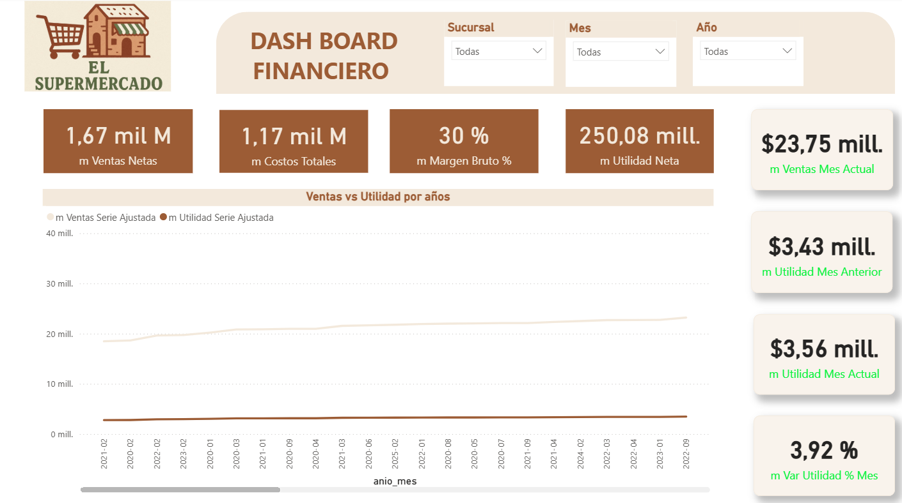
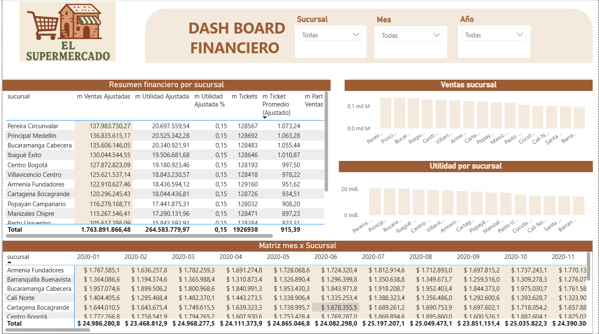
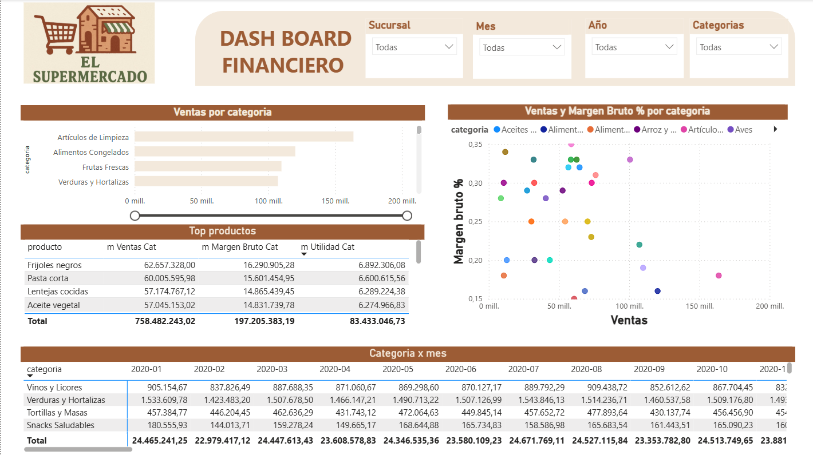

## Introducción

Este proyecto es un **dashboard financiero end-to-end** para un supermercado, construido con:
- **MySQL** para el modelado de la base de datos (esquema en estrella).
- **Python + Faker** para **generar datos sintéticos** realistas y reproducibles.
- **Power BI** para el análisis y la visualización, con **tres páginas**: Resumen ejecutivo, Sucursales y Categorías.

El objetivo es demostrar cómo pasar **de cero a un tablero ejecutivo** que responda preguntas clave del negocio:
- ¿Cuánto vendemos y con qué rentabilidad? (**Ventas Netas, Costos, Margen Bruto %, Utilidad Neta**).
- ¿Qué **sucursales** y **categorías** impulsan el resultado?
- ¿Cómo evoluciona el desempeño a lo largo del tiempo (tendencia y estacionalidad)?

Para evitar la “planicie” típica de los datos sintéticos, incorporé **variabilidad controlada** (factores por sucursal/categoría, estacionalidad mensual y micro-ruido determinístico), lo que permite simular escenarios más cercanos a la realidad sin usar datos sensibles.

> **Nota:** los datos son 100% **ficticios** y se generan con Faker; no representan información de clientes reales.

## Vista rápida

> Algunas vistas del dashboard en Power BI:

